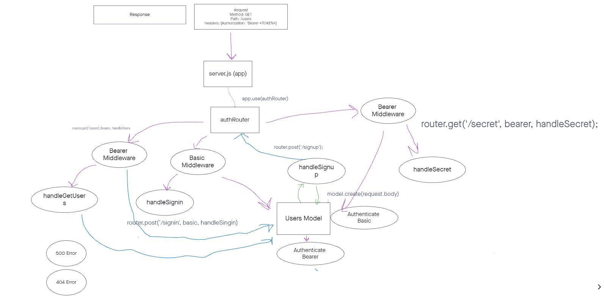

# auth-api

## Live Deploy

## Deployment

How do I install the app or library?
Clone this app and install all dependencies.

How do I test the app or library?
Run "NPM test" in the terminal once all dependencies are installed.

For Applications:
How do I run the app?
You can run the app on your local terminal.
You can also test routes on thunder client.
How do I set up the app?
Be sure to install all dependencies. You can publish through heroku.

## Testing

You can run [npm test] in the terminal for the these tests:

Testing users model
✓ User can have the role of admin, having the access to all CRUD

Testing reservations model
✓ User can create a reservation

You can also test these routes in thunder client:

- /signup
- /signin
- /api/v2/reservations(once user has signed up or in)

## Documentation

UML Reference

